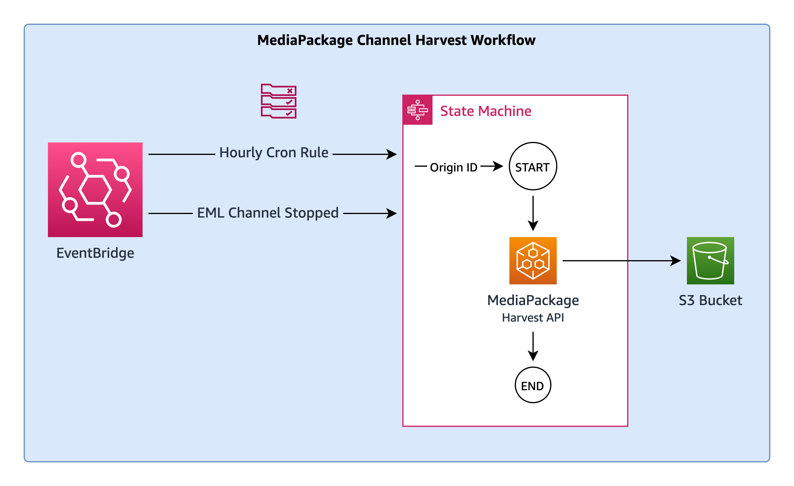

# MediaPackage Channel Harvest Workflow

This is a workflow that runs hourly to harvest all channels specified in a list of channels. There is also an EventBridge trigger that initiates a harvest when a MediaLive Channel is stopped



## Instructions

1. Configure workflow variables in `terraform.tfvars`.
```
account_id = "<ACCOUNT_ID>"
region_name = "<REGION_NAME>"

harvest_bucket = "<HARVEST_BUCKET>"
harvest_prefix = "<HARVEST_PREFIX_FOR_ALL_CHANNELS>"

// list of all channels
channel_configuration = [
  {
    channelName = "<CHANNEL_NAME>"
    medialiveChannelId = "<MEDIALIVE_CHANNEL_ID>"
    mediapackageChannelId = "<MEDIAPACKAGE_CHANNEL_ID>"
    mediapackageOriginEndpointId = "<MEDIAPACKAGE_ORIGIN_ENDPOINT_ID>"
  }
]
```

2. Deploy Terraform
```
terraform init
terraform deploy
```

## Known Issues
* Does not validate harvest job status.
* Does not validate whethere channel is running during hourly jobs.
* Does not deal with MediaLive triggers besides `Channel Stop`.
